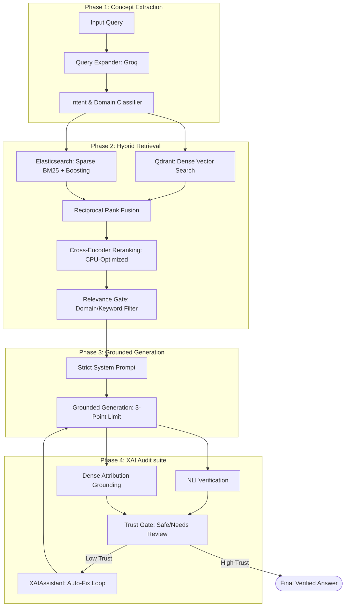

# Char-Chatore: Production-Grade Regulatory RAG Engine

Char-Chatore is a self-correcting, concept-aware RAG system designed to transform raw regulatory documents into high-trust compliance engines. It specializes in auditing RBI, SEBI, and banking guidelines with a focus on strict grounding and explainable attribution.

## 🏗️ Technical Architecture

The system follows a multi-stage pipeline designed to eliminate hallucinations and prioritize regulatory precision.



---

## 🚀 Dual-Mode Operational Flow

The engine operates in two specialized modes tailored for different compliance use cases.

### 📋 Query Mode (Standard RAG)
*   **Goal**: Precision and speed for general regulatory questions.
*   **Configuration**: 
    - `pull_limit`: 40 chunks
    - `fusion`: 80 chunks
    - `ce_candidates`: 10 chunks
    - `generation_cap`: Top 12
*   **Behavior**: Optimized for definitive answers with high XAI trust scores.

### 💼 BRD Mode (Business Compliance Mapping)
*   **Goal**: Maximum recall for mapping business requirements to complex regulations.
*   **Configuration**: 
    - `pull_limit`: 60 chunks
    - `fusion`: 120 chunks
    - `ce_candidates`: 16 chunks
    - `generation_cap`: Top 20
*   **Behavior**: Deep-tier retrieval to surface subtle intersections between different regulatory chapters.

---

## 🧠 Core Systems

### 🔍 Concept-Aware Retrieval
- **Expansion**: Generates 4-6 semantic variants using [query_expansion.py](rag/query_expansion.py) to improve search breadth.
- **Boosting**: Injects BM25 boosts into [retriever.py](rag/retriever.py) for critical terms like *fraud^3, risk^2*.
- **Filtering**: A strict [PassageFilter](rag/xai/relevance_filter.py) prevents "Semantic Drift" by rejecting chunks that don't match the query's identified domain (e.g., rejecting Capital ratio info for Fraud queries).

### 🛡️ Grounding & Trust (XAI)
- **Strict Prompting**: The generator in [chat.py](rag/chat.py) is forbidden from adding any external knowledge or generalizing beyond the retrieved chunks.
- **Attribution Engine**: Re-verifies every sentence of the answer using dense retrieval to ensure it is actually grounded in a specific source document.
- **Auto-Fix Loop**: If the system detects low trust ( < 80% attribution), it automatically triggers [XAIAssistant](rag/xai/assistant.py) to regenerate the answer with hardened constraints.

---

## 🛠️ Configuration & Setup

### Environment Flags (`backend/.env`)
| Flag | Description | Default |
| :--- | :--- | :--- |
| `RAG_QUERY_EXPANSION` | Toggles semantic expansion phase. | `1` |
| `RAG_RELEVANCE_FILTER` | Enables the domain/keyword relevance gate. | `1` |
| `XAI_AUTOFIX` | Enables automatic regeneration on low trust. | `1` |
| `XAI_INFERENCE` | Toggles the implicit reasoning layer. | `0` (Off for accuracy) |

---

## 🛠️ Execution

**Core Interaction** (from repository root):
```powershell
# Query Mode
python backend/rag/chat.py query "Your question here?"

# BRD Compliance Mode
python backend/rag/chat.py brd "Verify if transaction monitoring is required for UPI."
```

---
*Developed by Team 25 - Advanced Compliance AI*
